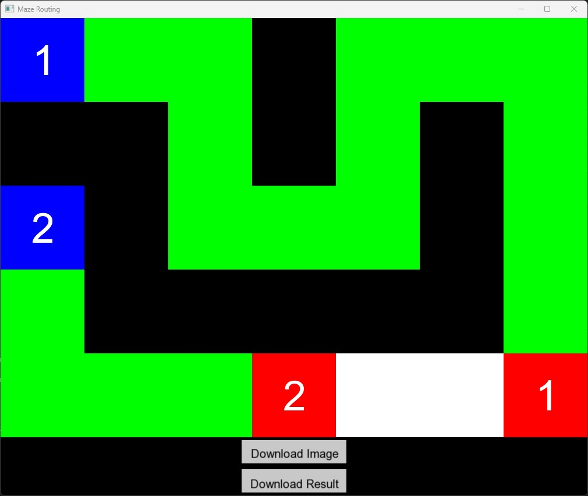

🌐 Available Languages: [English](README.md) | [繁體中文](README.zh-TW.md)

# Maze Routing GUI

A maze routing visualization application developed using the SFML graphics library.

## ✨ Features

- Maze routing visualization
<br><br>

- Interactive path hover effects with routing information
<br><br>

- Support for downloading maze screenshots
- Support for downloading routing results

## 💻 System Requirements

- C++ compiler
- SFML 2.x or higher
- Arial font file (arial.ttf)

## 🛠️ Compilation Instructions

### Using g++

```bash
# Basic compilation
g++ -c main.cpp draw.cpp -I/path/to/SFML/include
g++ main.o draw.o -o main -L/path/to/SFML/lib -lsfml-graphics -lsfml-window -lsfml-system

# Using C++17 standard
g++ -std=c++17 -c main.cpp draw.cpp -I/path/to/SFML/include
g++ main.o draw.o -o main -L/path/to/SFML/lib -lsfml-graphics -lsfml-window -lsfml-system
```

### Using Makefile

1. Ensure Makefile exists in the directory
2. Run the following commands:
```bash
make
# or
make all
```

Clean compilation files:
```bash
make clean
```

## 🚀 Execution Commands

```bash
# Basic execution (with GUI)
./main INPUT_MAZE.txt

# Using A* algorithm
./main INPUT_MAZE.txt --astar

# Display results only, no GUI
./main INPUT_MAZE.txt --no-gui

# Print detailed information in terminal
./main INPUT_MAZE.txt --print

# Example: Using multiple options
./main INPUT_MAZE.txt --astar --print
```

### Available Parameters

- `--print`: Print detailed execution information in the terminal
- `--no-gui`: Disable GUI, output results only
- `--astar`: Use A* algorithm for path finding

## 📝 INPUT_MAZE Format

The input file must follow this format:

1. First line: Two integers M N, representing the number of rows and columns
2. Next M lines: Each line contains N characters representing the maze layout
   - `.`: Empty space
   - `#`: Obstacle
   - `S1`, `S2`, ...: Start points (number after S indicates path ID)
   - `E1`, `E2`, ...: End points (number after E indicates path ID)

### Input Example

```
5 7
S1 . . # . . .
# # . # . # .
S2 # . . . # .
. # # # # # .
. . . E2 . . E1
```

Description:
- Maze size is 5 rows × 7 columns
- Two paths to find:
  - Path 1: from S1 to E1
  - Path 2: from S2 to E2
- `#` represents obstacles that paths cannot pass through
- `.` represents empty spaces that paths can pass through

## 📦 Output Files

- `maze_screenshot.png`: Screenshot of the maze
- `routing_results.txt`: Contains detailed information about all paths
  - Successful paths: Shows path ID and number of steps
  - Failed paths: Marked as failed

### Output Examples

#### routing_results.txt example:
```
route id: 1 => steps: 15
route id: 2 => steps: 23
Routing failed for net_id 3
route id: 4 => steps: 18
```

#### Terminal output example (using --print option):
```
Print the original maze:
1....
#####
2.2..
....1

Routing failed for net_id 1
route id: 2 => steps: 3

Print the solution to the maze routing problem:
1....
#####
222..
....1
```

## 🎨 Color Guide

⚪️ White: Empty space

⚫️ Black: Obstacle

🔵 Blue: Start point

🔴 Red: End point

🟢 Green: Path

🟣 Purple: Currently hovered path

## ⚠️ Notes

- Ensure arial.ttf font file is in the program directory
- Routing result files will overwrite existing files with the same name
- Make sure SFML library paths are correct during compilation
- If using Makefile, ensure the paths in Makefile are correctly set 