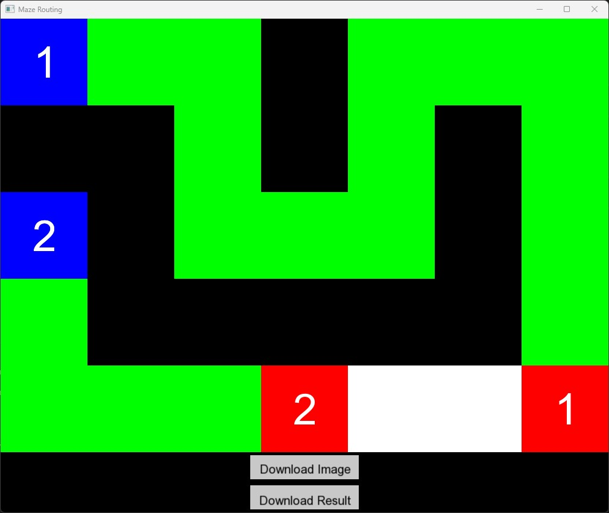
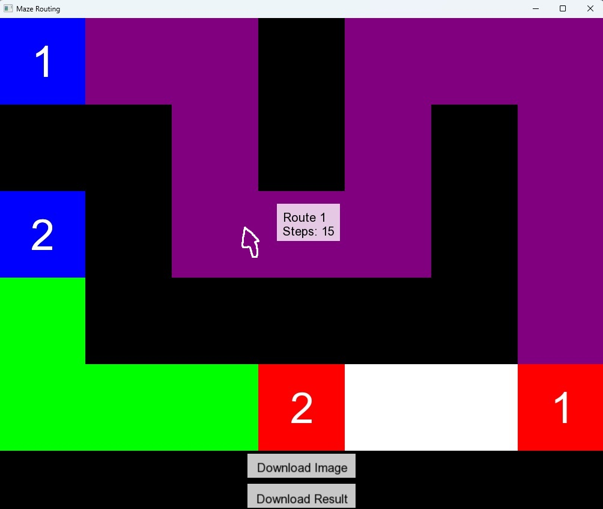

🌐 語言選擇: [English](README.md) | [繁體中文](README.zh-TW.md)

# Maze Routing GUI

這是一個使用 SFML 圖形庫開發的解迷宮問題視覺化應用程式。包含 BFS、Astar、ILP 三種不同的演算法。


## ✨ 功能特點

- 特別的 ILP 演算法

- 迷宮問題的可視化顯示
<br><br>

- 互動式路徑懸停效果，顯示路徑信息
<br><br>

- 支持下載迷宮截圖
- 支持下載路徑結果

## 📊 ILP 演算法
假設一開始有 N 個 Nets 要 routing，我們會初始化一個 set `remaining_nets`，使用者可以用 `--max-iter` 參數設定疊代的次數，在每次疊代中：
  
    1. remaining_nets 中的各個 Nets 用 BFS 嘗試找尋 routes，各 Nets 找到的 routes 可能會衝突（共用某個 cell）。
    2. 在上一步驟找到的 routes 中，用 ILP 演算法找到 "最多有幾條 routes 可以共存不會衝突"
    3. 將這些沒有衝突的 routes 從 remaining_nets 中刪除，表示我們已經確定它們的路徑了，之後找其他 routes 時不可以和它們衝突。
    4. 若 remaining_nets 中還有元素，且 尚未遞迴到第 --max-iter 輪，則回到步驟 1. 繼續執行。

## 💻 系統需求

- C++ 編譯器
- SFML 2.x 或更高版本
- Arial 字體文件 (arial.ttf)
- Gurobi Optimizer 10.0 或更高版本
  - 請從 [Gurobi 官網](https://www.gurobi.com/downloads/) 下載並安裝
  - 需要有效的 Gurobi 授權（可申請免費的學術授權）

## 🛠️ 編譯說明

### 使用 g++ 編譯

```bash
# 基本編譯指令
g++ -c main.cpp draw.cpp -I/path/to/SFML/include -I/path/to/gurobi/include
g++ main.o draw.o -o main -L/path/to/SFML/lib -L/path/to/gurobi/lib -lsfml-graphics -lsfml-window -lsfml-system -lgurobi_c++ -lgurobi100

# 使用 C++17 標準編譯
g++ -std=c++17 -c main.cpp draw.cpp -I/path/to/SFML/include -I/path/to/gurobi/include
g++ main.o draw.o -o main -L/path/to/SFML/lib -L/path/to/gurobi/lib -lsfml-graphics -lsfml-window -lsfml-system -lgurobi_c++ -lgurobi100
```

### 使用 Makefile 編譯
1.確保目錄中有 Makefile 文件

2.在 Makefile 中設置 Gurobi 路徑：
   ```makefile
   GUROBI_DIR = /path/to/gurobi
   GUROBI_INCLUDE = $(GUROBI_DIR)/include
   GUROBI_LIB = $(GUROBI_DIR)/lib
   GUROBI_LIBS = -lgurobi_c++ -lgurobi100
   ```
3.執行以下指令：
```bash
make
# 或
make all
```

清理編譯文件：
```bash
make clean
```

## 🚀 執行指令

```bash
# 基本執行（使用圖形界面）
./main INPUT_MAZE.txt

# 使用 A* 演算法
./main INPUT_MAZE.txt --astar

# 使用 ILP 演算法
./main INPUT_MAZE.txt --ilp [--max-iter N] [--time-limit T] [--threads T]

  * --max-iter： 遞迴次數（預設為 1）
  * --time-limit： ILP Solver 時間限制（預設為 30 秒）
  * --threads： ILP Solver 執行緒數量

# 只顯示結果，不顯示圖形界面
./main INPUT_MAZE.txt --no-gui

# 在終端機印出詳細訊息
./main INPUT_MAZE.txt --print

# 範例：使用多個選項
./main INPUT_MAZE.txt --ilp --max-iter 3 --print
```

### 可用參數

- `--print`: 在控制台打印詳細的執行信息
- `--no-gui`: 關閉圖形界面，只輸出結果
- `--astar`: 使用 A* 演算法進行路徑搜索
- `--ilp`: 使用 ILP 演算法進行路徑搜索
  - `--max-iter N`: 設置 ILP 遞迴次數
  - `--time-limit T`: 設置 ILP 求解時間限制（秒）
  - `--threads T`: 設置 ILP 求解器使用的執行緒數量


## 📝 INPUT_MAZE 格式

輸入文件必須遵循以下格式：

1.第一行：兩個整數 M N，表示迷宮的行數和列數

2.接下來 M 行：每行包含 N 個字符，表示迷宮的布局
   - `.`: 空白區域
   - `#`: 障礙物
   - `S1`, `S2`, ...: 起點（S 後面的數字表示路徑 ID）
   - `E1`, `E2`, ...: 終點（E 後面的數字表示路徑 ID）

### 輸入範例

```
5 7
S1 . . # . . .
# # . # . # .
S2 # . . . # .
. # # # # # .
. . . E2 . . E1
```

說明：
- 迷宮大小為 5 行 7 列
- 有兩條路徑需要尋找：
  - 路徑 1：從 S1 到 E1
  - 路徑 2：從 S2 到 E2
- `#` 表示障礙物，路徑不能通過
- `.` 表示空白區域，路徑可以通過


## 📦 輸出文件

- `maze_screenshot.png`: 迷宮的截圖
- `routing_results.txt`: 包含所有路徑的詳細信息
  - 成功路徑: 顯示路徑 ID 和所需步數

### 輸出範例

#### routing_results.txt 範例：
```
route id: 1 => steps: 15
route id: 2 => steps: 23
Routing failed for net_id 3
route id: 4 => steps: 18
```

#### 終端機輸出範例（使用 ---print 選項）：

Routing failed for net_id 1

route id: 2 => steps: 3


## 🎨 顏色說明

⚪️ 白色: 空白區域

⚫️ 黑色: 障礙物

🔵 藍色: 起點

🔴 紅色: 終點

🟢 綠色: 路徑

🟣 紫色: 當前懸停的路徑


## ⚠️ 注意事項

- 確保程式目錄中有 arial.ttf 字體文件
- 路徑結果文件會覆蓋已存在的同名文件
- 編譯時請確保 SFML 庫路徑正確
- 如果使用 Makefile，請確保 Makefile 中的路徑設置正確 